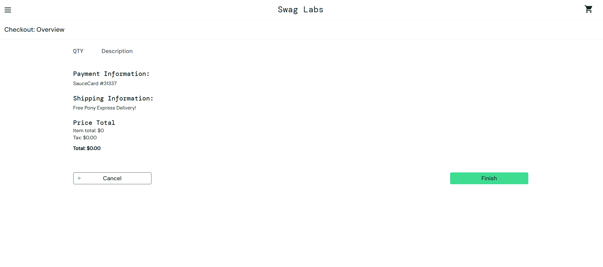
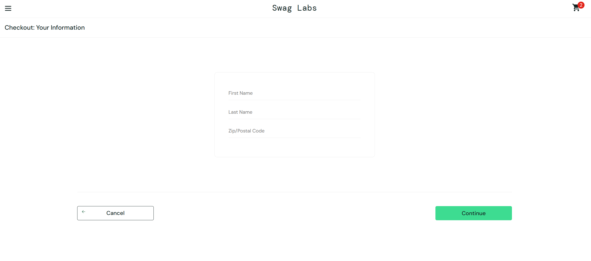
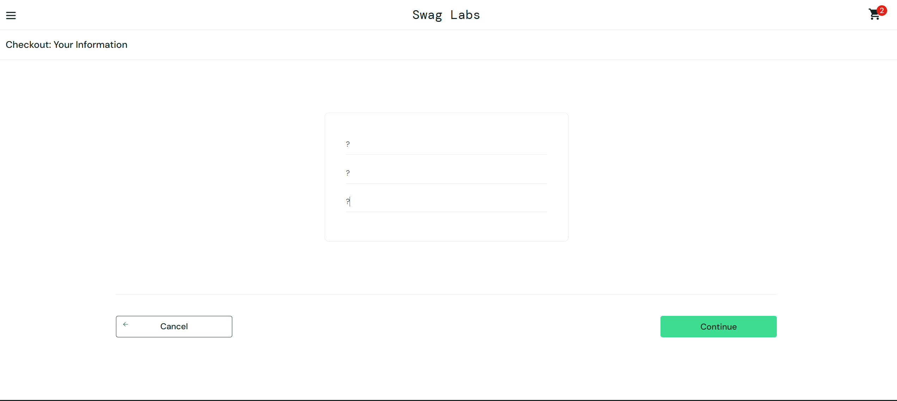
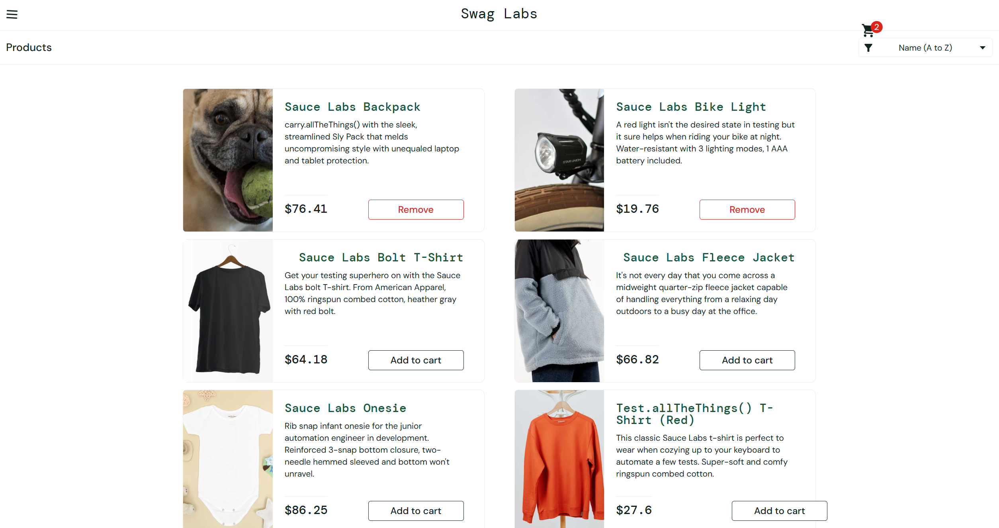
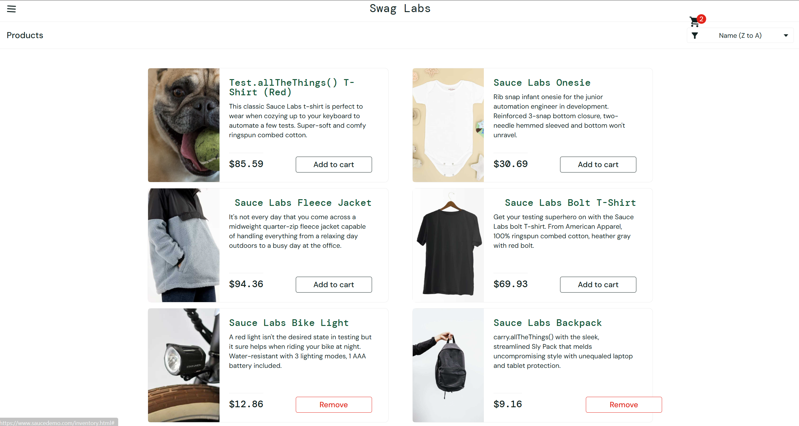
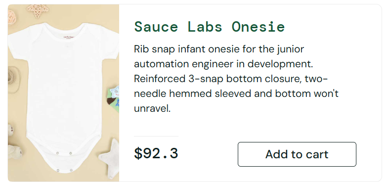
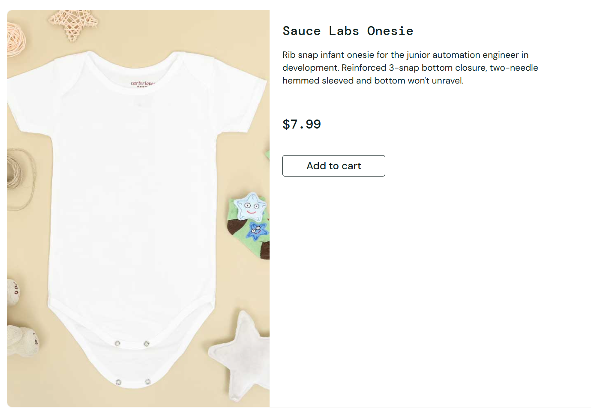

# SauceDemo – Manual Testing Project (2025)

**Objetivo.**  
Realizar pruebas manuales sobre la plataforma SauceDemo para identificar errores, inconsistencias y mejoras en la experiencia de usuario. El proyecto se realizó como práctica inicial del curso de Testing en Jóvenes a Programar.

**Alcance del proyecto.**  
Se probó el sitio web en escenarios de compra, filtros, precios, formularios y navegación general. Incluye test cases, reportes de bugs y sugerencias de mejora.

**Herramientas.**  
- Excel (diseño y seguimiento de casos de prueba)  
- Capturas de pantalla para evidencias

**Principales hallazgos.**  
- Checkout permite finalizar compra con carrito vacío → bug crítico  
- Formulario acepta cualquier carácter en campos obligatorios → bug medio  
- Precios en catálogo y detalle del producto no coinciden → bug medio
- Filtros no funcionan, los productos cambian de lugar o precio → bug medio  
- Interfaz del carrito y opciones de cantidad poco intuitivas → sugerencia de mejora

**Capturas.**  
  
  
  
  
  

**Archivos.**  
- `test-cases.xlsx` (casos de prueba documentados)  
- `bugs.md` (listado de bugs y sugerencias de mejora)  

**Autor.**  
Enzo Thome — Software Tester Jr.

