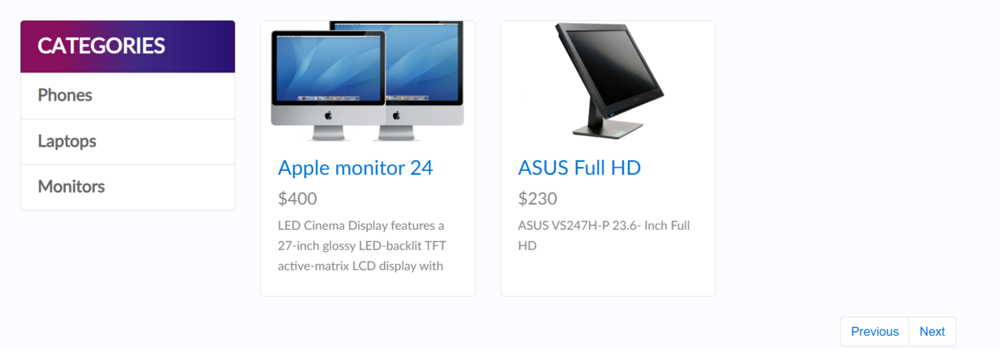
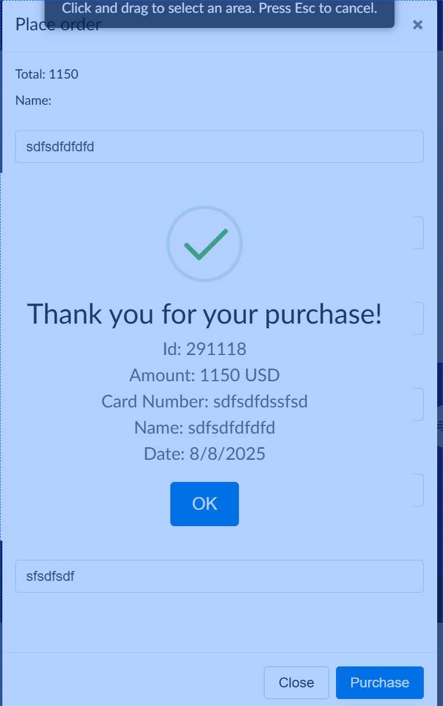
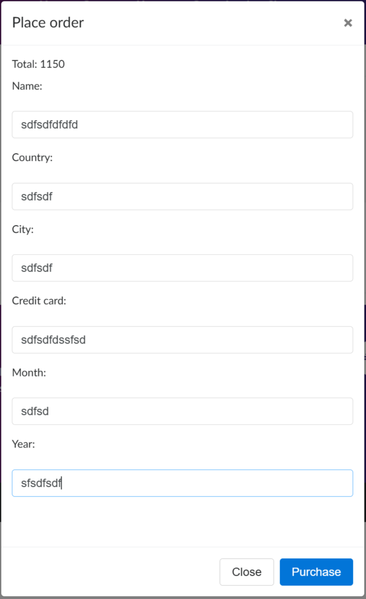
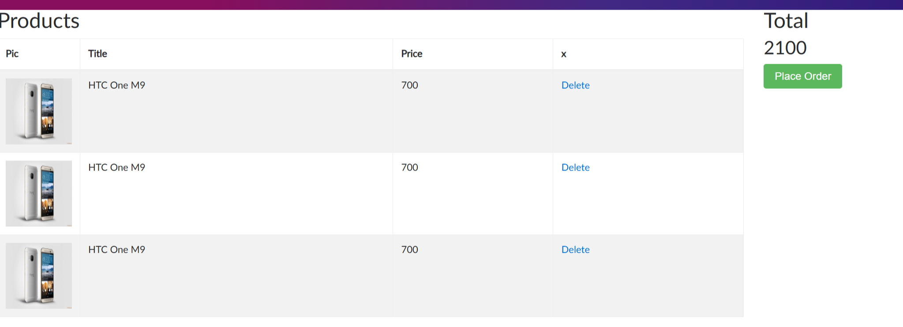
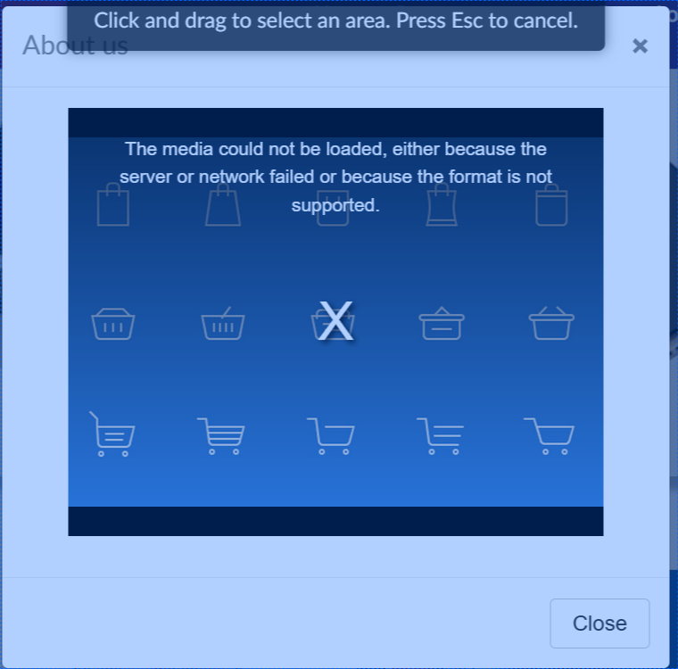

# Demoblaze - Manual Testing Project (2025)

## Objetivo
Ejecutar pruebas funcionales sobre la tienda online **Demoblaze** para identificar bugs y proponer mejoras.

## Alcance del proyecto
Se probó el sitio web en escenarios de compra, filtros, precios, formularios y navegación general.  
El trabajo incluye **casos de prueba, reportes de bugs y sugerencias de mejora**.

## Herramientas
- **Jira** (gestión de bugs y mejoras)  
- **Excel** (documentación de casos de prueba)  
- **Exploratory Testing Chrome Extension** (registro de pruebas)  

## Principales hallazgos
- Checkout permite avanzar con campos inválidos  
- Formulario de contacto acepta caracteres inválidos en campos obligatorios  
- Botones de página que no funcionan correctamente  
- Video que no funciona  

## Sugerencias de mejora
- Usar un ícono para el carrito de compras en lugar de la palabra "Cart"  
- Eliminar las barras en las fotos de los productos  
- Descartar la funcionalidad de registrar un usuario  
- Agrupar los mismos productos en una sola línea en el carrito  
- Corregir el slider de la página de inicio  

## Capturas
  
  
  
  
  
  
  
  
  
  

## Archivos
- `test-cases.xlsx` → Casos de prueba documentados  
- `bugs.md` → Listado manual de bugs y mejoras encontrados  
- `jira-export-bugs.csv` → Exportación completa desde Jira (bugs, mejoras y notas)  
- `Exploratory Testing Session Report.png` → Resumen visual de la sesión  
- `Exploratory Testing Report_2025-09-08.html` → Reporte completo de la extensión (abrir en navegador)

## Autor
Enzo Thome – **Software Tester Jr.**

